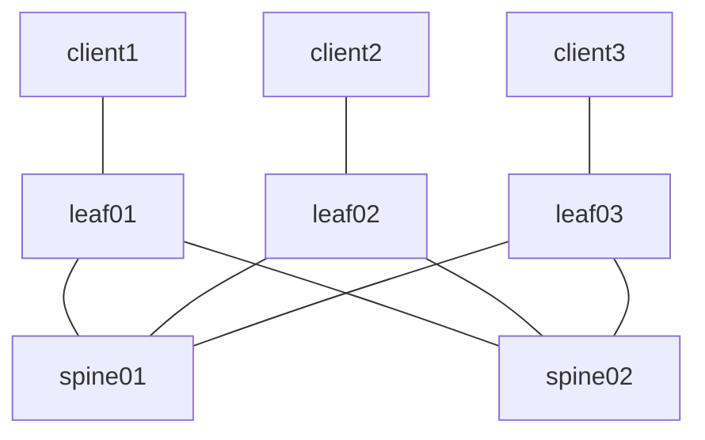

# clab-crpd-evpn-vxlan

## Overview

A three-stage Layer 3 Leaf/Spine (L3LS) EVPN fabric using [CONTAINERlab](https://containerlab.dev/) and [cRPD](https://www.juniper.net/documentation/us/en/software/crpd/crpd-deployment/topics/concept/understanding-crpd.html) nodes to enable Layer 2 (intra-VNI) and Layer 3 (inter-VNI) connectivity between three clients. The fabric generally follows the [Edge-Routed Bridging Overlay](https://www.juniper.net/documentation/us/en/software/nce/sg-005-data-center-fabric/topics/task/edge-routed-overlay-cloud-dc-configuring.html) design guide and utilizes the MAC-VRF routing instance type. The underlay connectivity in this fabric is faciliated by eBGP/EVPN, and the overlay connectivity is facilitated by VXLAN.

## Requirements

- [CONTAINERlab](https://containerlab.dev/install/)
  - _The [CONTAINERlab](https://containerlab.dev/install/) installation guide outlines various installation methods. This lab assumes all [pre-requisites](https://containerlab.dev/install/#pre-requisites) (including Docker) are met and CONTAINERlab is installed via the [install script](https://containerlab.dev/install/#install-script)._
- Docker cRPD [image](https://www.juniper.net/documentation/us/en/software/crpd/crpd-deployment/topics/task/crpd-linux-server-install.html#id-loading-the-crr-image) >= 22.4R1-S2.1
  - Adjust the ```topology.kinds.crpd.image``` value in [setup.yml](setup.yml) to reflect the proper image and tag

  ```shell
  $ docker image ls | grep crpd
  crpd                       22.4R1-S2.1    9ed0a701769a   14 months ago   546MB
  ```

- A valid Juniper cRPD license key placed in a file called ```junos.lic``` at the root of the repository (same level as [setup.yml](setup.yml)).
  - **_NOTE: The features required by this lab will not function without a valid license installed on the cRPD nodes and therefore the Makefile will exit before even proceeding with setup if one is not detected. You can obtain a free evaluation license from [here](https://www.juniper.net/us/en/dm/crpd-free-trial.html)_**
- Python 3

## Topology



## Resources

### IP Assignments

_**NOTE**: The Overlay/VTEP assignments for spine01/spine02 are not actually implemented, or even required, since our VTEP's in this lab are on leaf01/leaf02/leaf03. The assignments are therefore just for consistency purposes_

| Scope              | Network       | Sub-Network    | Assignment     | Name            |
| ------------------ | ------------- | -------------  | -------------  | -------         |
| Management         | 10.0.0.0/24   |                | 10.0.0.2/24    | spine01         |
| Management         | 10.0.0.0/24   |                | 10.0.0.3/24    | spine02         |
| Management         | 10.0.0.0/24   |                | 10.0.0.4/24    | leaf01          |
| Management         | 10.0.0.0/24   |                | 10.0.0.5/24    | leaf02          |
| Management         | 10.0.0.0/24   |                | 10.0.0.6/24    | leaf03          |
| Router ID (lo0.0)  | 10.1.0.0/24   |                | 10.1.0.1/32    | spine01         |
| Router ID (lo0.0)  | 10.1.0.0/24   |                | 10.1.0.2/32    | spine02         |
| Router ID (lo0.0)  | 10.1.0.0/24   |                | 10.1.0.3/32    | leaf01          |
| Router ID (lo0.0)  | 10.1.0.0/24   |                | 10.1.0.4/32    | leaf02          |
| Router ID (lo0.0)  | 10.1.0.0/24   |                | 10.1.0.5/32    | leaf03          |
| P2P Links          | 10.2.0.0/24   | 10.2.0.0/31    | 10.2.0.0/31    | spine01::leaf01 |
| P2P Links          | 10.2.0.0/24   | 10.2.0.0/31    | 10.2.0.1/31    | leaf01::spine01 |
| P2P Links          | 10.2.0.0/24   | 10.2.0.2/31    | 10.2.0.2/31    | spine01::leaf02 |
| P2P Links          | 10.2.0.0/24   | 10.2.0.2/31    | 10.2.0.3/31    | leaf02::spine01 |
| P2P Links          | 10.2.0.0/24   | 10.2.0.4/31    | 10.2.0.4/31    | spine02::leaf01 |
| P2P Links          | 10.2.0.0/24   | 10.2.0.4/31    | 10.2.0.5/31    | leaf01::spine02 |
| P2P Links          | 10.2.0.0/24   | 10.2.0.6/31    | 10.2.0.6/31    | spine02::leaf02 |
| P2P Links          | 10.2.0.0/24   | 10.2.0.6/31    | 10.2.0.7/31    | leaf02::spine02 |
| P2P Links          | 10.2.0.0/24   | 10.2.0.8/31    | 10.2.0.8/31    | spine01::leaf03 |
| P2P Links          | 10.2.0.0/24   | 10.2.0.8/31    | 10.2.0.9/31    | leaf03::spine01 |
| P2P Links          | 10.2.0.0/24   | 10.2.0.10/31   | 10.2.0.10/31   | spine02::leaf03 |
| P2P Links          | 10.2.0.0/24   | 10.2.0.10/31   | 10.2.0.11/31   | leaf03::spine02 |

### Underlay ASN Assignments

| ASN   | Device  |
| ----- | ------- |
| 65500 | spine01 |
| 65501 | spine02 |
| 65502 | leaf01  |
| 65503 | leaf02  |
| 65504 | leaf03  |

### Overlay ASN Assignment

| ASN   | Device  |
| ----- | ------- |
| 65555 | all     |

### VXLAN Segments (L2VNI)

| vni | name  | network      | leaf   | host    | host ip   | vlan | gateway     |
| --- | ----  | ------------ | ------ | ------- | --------- | ---- | ----------- |
| 110 | RED   | 10.10.1.0/24 | leaf01 | client1 | 10.10.1.1 | 10   | 10.10.1.254 |
| 110 | RED   | 10.10.1.0/24 | leaf02 | client2 | 10.10.1.2 | 10   | 10.10.1.254 |
| 120 | BLUE  | 10.10.2.0/24 | leaf03 | client3 | 10.10.2.1 | 20   | 10.10.2.254 |

### VXLAN Tenants (L3VNI)

| vni | name   |
| --- | ----   |
| 999 | ORANGE |

## Deployment

Clone this repsoitory and start the lab

```shell
git clone https://github.com/dbono711/clab-crpd-evpn-vxlan.git
cd clab-crpd-evpn-vxlan
make all
```

**_NOTE: CONTAINERlab requires SUDO privileges in order to execute_**

**_NOTE: As indicated in [Requirements](#requirements), a valid Juniper license file named ```junos.lic``` is required_**

- Initializes the ```setup.log``` file
- Creates the [CONTAINERlab network](setup.yml) based on the [topology definition](https://containerlab.dev/manual/topo-def-file/)
  - Apply's the ```config``` file from the respective ```spine``` and ```leaf``` folders on each cRPD node
    - This configuration is only meant to bootstrap the root authentication password and enable SSH
- Apply's the cRPD license on each cRPD node
- Loops through each client to execute the configuration SHELL scripts within the [clients](clients) folder
  - The script configures the clients Ethernet/VLAN interface connected to the leaf
- Executes an Ansible playbook for configuring the fabric underlay, overlay, EVPN, & VXLAN on each cRPD node
- Executes a PING from ```client1``` to ```client2``` to validate intra-VNI data plane connectivity between clients
- Executes a PING from ```client1``` to ```client3``` to validate inter-VNI data plane connectivity between clients

## Accessing the container SHELL

The container SHELL can be accessed by using the ```docker exec``` command, as follows:

```docker exec -it <container> bash```

For example, to access the SHELL on the ```spine01``` cRPD container

```shell
$ docker exec -it clab-crpd-evpn-vxlan-spine01 bash
bash-5.1#
```

## Accessing the JUNOS CLI (via Docker)

The JUNOS CLI can be accessed by using the ```docker exec``` command, as follows:

```docker exec -it <container> cli```

For example, to access the JUNOS CLI via Docker on the ```spine01``` cRPD container

```shell
$ docker exec -it clab-crpd-evpn-vxlan-spine01 cli
bash-5.1#
```

## Accessing the JUNOS CLI (via SSH)

Each cRPD node also has an SSH port mapped in the [topology](setup.yml). In fact, this is how Ansible communicates with the cRPD nodes to configure them as part of the ```configure``` target in the [Makefile](Makefile).

**Username:** root
**Password:** clab123

For example, to access the JUNOS CLI via SSH on the ```spine01``` cRPD container

```shell
$ ssh -p 10022 root@10.0.0.2
bash-5.1#
```

## Capturing packets

Here is an example on how to capture packets directly on the host which CONTAINERlab is running

```sudo ip netns exec clab-crpd-evpn-vxlan-leaf01 tcpdump -nni eth1```

Here is an example on how to capture packets from a remote host, to the host which CONTAINERlab is running (Note that this example is piping directly to Wireshark which in my case is running on my MAC OS X host)

```ssh [ containerlab host ] "sudo -S ip netns exec [ containerlab container name ] tcpdump -nni eth1 -w -" | /Applications/Wireshark.app/Contents/MacOS/Wireshark -k -i -```

## Data Plane Validation

The [Makefile](Makefile) performs data plane validation by executing the [validate.py](validate.py) Python script which performs a PING from ```client``` to ```client2``` for validating Layer 2 (intra-VNI) connectivity, and a PING from ```client1``` to ```client3``` for validating Layer 3 (inter-VNI) connectivity, and thats it. The script therefore leaves plenty of room for more advanced validation such as parsing JSON output from the cRPD nodes, analyzing bridge fdb tables at the Linux level of the cRPD and client nodes, etc.

## Cleanup

Stop the lab, tear down the CONTAINERlab containers

```shell
make clean
```

## Logging

All activity is logged to a file called ```setup.log``` at the root of the repository.

## Authors

- Darren Bono - [darren.bono@att.net](mailto://darren.bono@att.net)

## License

This project is licensed under the MIT License. See [LICENSE](LICENSE) for details
